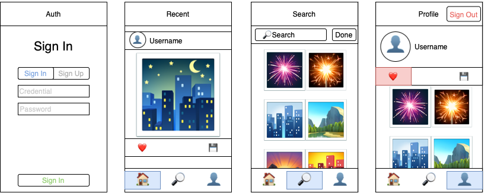

# Pazarama iOS Bootcamp - Hafta 4 - Ödev

# Screenshots

## Flickr App

Uygulamamızı geliştirirken Flickr API ve Firebase araçlarını kullanacağız. Uygulamada Firebase Auth ile kullanıcı kayıt ve giriş işlemlerini yöneteceğiz. Uygulamanın ana ekranında Flickr API’ı kullanarak son yüklenen fotoğrafları UITableViewController kullanarak listeleyeceğiz. Bu aşamada özelleşmiş bir UITableViewCell ile Instagram’daki post benzeri bir görünüm oluşturacağız. Kullanıcı görseli beğenebilir, kütüphanesine kaydedebilir ve profil ekranından önceden beğendiği veya kütüphaneye kaydettiği fotoğrafları görüntüleyebilir. Firebase firestore kullanılarak bilgiler buluta kaydedilmelidir.

Uygulamada arama ekranı olmalıdır. Arama ekranında mevcut bir arama olmadığı sürece popüler fotoğraflar UICollectionViewController ile grid görünümünde listelenmelidir. Eğer bir arama işlemi gerçekleştirilirse Flickr API aracılı ile girilen anahtar kelimeye uygun olarak arama yapılır ve görseller listelenir. Arama işlemi bittiğinde ekranda popüler paylaşımlar gözükmeye devam edecektir. 

Kullanıcı profilini düzenleyebilir olmalıdır. Bir profil fotoğrafı ekleyebilir veya kullanıcı adını değiştirebilir. Firebase remote config kullanılarak uygulamaya kayıt olma özelliği etkinleştirilebilir veya devre dışı bırakabilir. Kullanıcı profil ekranından çıkış yapıp giriş ekranına yönlendirilmelidir.

## Değerlendirme Kriterleri

1. Flickr API ile iletişim katmanının Moya kütüphanesi aracılığı ile oluşturulması.
2. Firebase Auth, Remote Config ve Firestore özelliklerinin kullanılması.
3. Uygulamanın ekranlarının açıklamaya uygun şekilde tasarlanması.
4. MVVM tasarım düzeninin kullanılması.
5. Controller ve ViewModel arasındaki iletişimin Delegate veya Closure kullanılarak yapılması.
6. Ekran tasarımlarının SnapKit ile programlayarak veya Xib dosyaları ile yapılması.
7. Minimum versiyon desteğinin iOS 12.0 olması.
8. IQKeyboardManager ile input alanları arasındaki geçişin yönetilmesi. Klavyenin ekranda bir boşluğa dokununca veya klavye üstündeki toolbarda yer alan KAPAT butonuna basarak kapatılabilmesi.
9. Üçüncü parti kütüphanelerin Cocoapods veya SPM ile entegrasyonu.

## Faydalı Linkler

- Flickr API: https://www.flickr.com/services/api/
- Firebase Auth: https://firebase.google.com/docs/auth/ios/start
- Firebase Firestore: https://firebase.google.com/docs/firestore/quickstart
- Firebase Cloud Storage: https://firebase.google.com/docs/firestore/quickstart
- Firebase Remote Config: https://firebase.google.com/docs/remote-config/?authuser=0
- Örnek Proje:  https://github.com/232-Pazarama-iOS-Swift-Bootcamp/week4_day1_crypto_app
